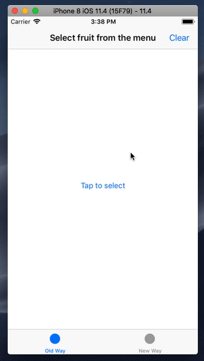

# DSDMenu

[](https://travis-ci.org/m3g0byt3/DSDMenu)
[](https://cocoapods.org/pods/DSDMenu)
[](https://github.com/Carthage/Carthage)
[](https://cocoapods.org/pods/DSDMenu)
[](https://cocoapods.org/pods/DSDMenu)

[](https://github.com/m3g0byt3/DSDMenu)


— **D**ead **S**impe **D**ropdown **M**enu

A simple drop-down menu written in Swift.




## Features
---
* Automatically update menu button content based on selected cell
* Use delegate or configuration closure to setup menu
* Use default or custom menu cells (with and without NIBs)
* Create menu programmatically or in the Interface Builder


## Requirements
---
* iOS 9.0+
* Xcode 9.0+
* Swift 4.0+


## Example
---
To run the example project, clone the repo, and run `pod install` from the Example directory first.


## Installation
---
### CocoaPods

[CocoaPods] is a dependency manager for Swift and Objective-C Cocoa projects. You can install it with the following command:

```bash
$ sudo gem install cocoapods
```

To integrate DSDMenu, simply add the following line to your `Podfile`:

```ruby
pod 'DSDMenu'
```

Then, run the following command:

```bash
pod install
```

### Carthage

[Carthage] is a decentralized dependency manager that builds your dependencies and provides you with binary frameworks.

You can install Carthage with [Homebrew] using the following command:

```bash
$ brew update
$ brew install carthage
```
To integrate DSDMenu into your Xcode project using Carthage, specify it in your `Cartfile`:

```ogdl
github "m3g0byt3/DSDMenu"
```

Run `carthage update` to build the framework and drag the built `DSDMenu.framework` into your Xcode project.


## Usage
---
### Initialization:
1. #### Programmatically:

	Use convenience initializer:
	
	```swift
	init(title: String, frame: CGRect = CGRect.zero)
	```
	
2. #### Using Interface Builder
	
	Place a `UIButton` object on the storyboard and change custom class as pictured below:
	
	

### Customize menu behaviour:

DSDMenu can be customized and controlled using two ways (mutually exclusive!):

1. #### Using delegete (old-way):
	Confrom to `DropDownDelegate` protocol and assign delegate:
	1. Programmatically:

		```swift
		menu.delegate = self
		```
		
	2. Using Interface Builder:
	
		
	
2. #### Using configuration closure (new-way):

	Instantiate menu instance, then pass closure with a `DropDownMenuConfigurator` instance inside, configured within this closure, to the `configure(using: (DropDownMenuConfigurator) -> Void)` method:
	
	```swift
   menu.configure { configurator in
      configurator.cellClass(DropDownCell.self)
                  .numberOfItems(10)
                  .updateThumbnailOnSelection(true)
                  .didSelectItem { index in print(index) }
                  .willDisplayCell { (cell, index) in print(cell, index) }
   }
	```


## API reference:
---

| Delegate method                        | Configuration method equivalent | Description                                                                                 |
|----------------------------------------|--------------------------------|---------------------------------------------------------------------------------------------|
| numberOfItems(in:)                     | numberOfItems(\_:)             | Asks the delegate for the number of items in menu                                           |
| cellClass(for:)                        | cellClass(\_:)                 | Asks the delegate for the cell class used in menu                                           |
| dropDownMenu(\_:didSelectItemAt:)      | didSelectItem(\_:)             | Tells the delegate that the item in the menu was tapped                                     |
| dropDownMenu(\_:willDisplay:forRowAt:) | willDisplayCell(\_:)           | Tells the delegate that the cell in the menu is about to be displayed                       |
| updateThumbnailOnSelection(in:)        | updateThumbnailOnSelection(_:) | Asks the delegate whether the menu should update thumbnail image automatically on selection |


## TODO Section
---
- [x] Configure using closure instead of delegate
- [x] Auto-update view based on selected cell's content
- [x] Setup constraints in `updateConstraints()` ([see also])
- [x] Setup Pod
- [x] Complete README
- [ ] Correct handling of orientation changes when `updateThumbnailOnSelection = true`
- [ ] Use POP for cells instead subclassing (if possible?)
- [ ] Allow to customize menu's appearance (shadows, colors, etc)


## Contributing
---
Contributing is always welcomed, just follow these steps:

1. Fork
2. Create your feature branch (`git checkout -b my-new-feature`)
3. Commit your changes (`git commit -am 'Add some feature'`)
4. Push to the branch (`git push origin my-new-feature`)
5. Create new Pull Request

That's it!


## Author
---
[m3g0byt3]


## License
---
DSDMenu is released under an MIT license. See [LICENSE] for more information.


[//]: #
[LICENSE]: 	<https://github.com/m3g0byt3/dsdmenu/blob/master/LICENSE>
[m3g0byt3]: 	<https://github.com/m3g0byt3>
[See also]: <https://stackoverflow.com/questions/34295577/where-to-add-auto-layout-constraints-code-within-a-custom-uiview>
[CocoaPods]: <https://cocoapods.org>
[Carthage]: <https://github.com/Carthage/Carthage>
[Homebrew]: <http://brew.sh/>